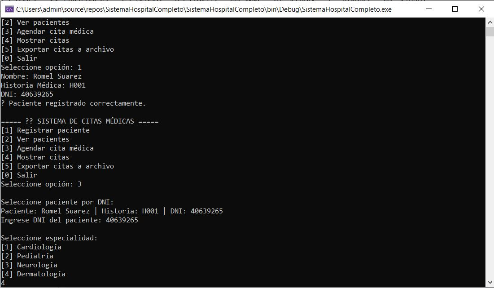

## Sistema Hospitalario
### Sistema de Citas Medicas
### Sistema que permite separar citas medicas mediante el DNI del paciente para lo cual se tiene que registrar asignandole un Cod de Historia medica, nombre y DNI

- Registra Pacientes asignando una cod de Historia Medica, Nombre y su DNI
- Ver Pacientes con el DNI del paciente
- Agenda Citas Medicas con el DNI de paciente, al que se asigna una especialidad, 1 doctor y 1 horario
- Mostrar cintas en Archivo
- Salir 
